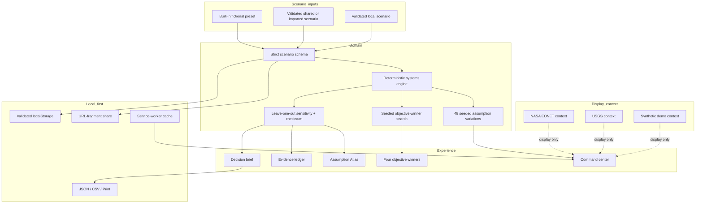

# Architecture

## Goals

Morrow is designed to be stage-safe, inspectable, and usable without a network connection after installation. Its architectural priorities are:

1. No account, external API key, or network dependency for the core rehearsal.
2. The same scenario, model version, dataset version, assumption pack, and seed reproduce the same result.
3. Model logic stays independent from React and can be tested without a browser.
4. Imported, locally saved, or shared state is treated as hostile input and validated.
5. Every visual result has a text or table path.
6. Optional public-event context is display only and cannot alter or block the model.
7. An optional backend API may support connected operation, but the browser-side model remains the source of rehearsal results.

## System map



Context events have no path into the scenario schema or model engine.

## Source layout

```text
src/
  components/       shared controls, status, commands, and notifications
  data/             versioned presets, assumptions, and source registry
  domain/           pure model, seeded search, RNG, schema, and share codec
  features/
    landing/        public product story
    cockpit/        command center, map, charts, and intervention lab
    cascade/        Assumption Atlas and shared stress control
    compare/        four seeded-search objective winners
    evidence/       provenance, lineage, and model boundaries
    brief/          print and export artifact
  services/         context connectors, local persistence, and downloads
  test/             browser-side test setup
public/             manifest, service worker, icons, and host headers
server/             optional backend API; not required by the local model
e2e/                critical browser journey
```

Server-specific endpoints and operating details are intentionally left to the server documentation rather than duplicated here.

## Runtime flow

1. `App.tsx` constructs a built-in scenario or validates shared, imported, or locally saved state.
2. `simulateScenario` runs the selected scenario and a matching no-action comparator.
3. The engine runs 48 assumption variations with seeded `mulberry32`; it never uses `Math.random()`.
4. The UI receives trajectories, descriptive variation bands, model proxies, leave-one-out sensitivity, and a fingerprint.
5. The seeded search generates 160 budget-valid portfolios, screens their direct metrics against four explicit objectives, and retains one winner per score.
6. Only those four objective winners receive the full 48-variation sensitivity run before display; duplicate allocation winners share one run, and visible scores are recalculated from the displayed metrics.
7. React renders the orientation map, charts, Assumption Atlas, comparison, evidence, and brief from the result object.

## Context-signal boundary

The context layer reports three user-facing states:

- **LIVE:** both public connectors responded and valid context events are available.
- **PARTIAL:** valid events are available from only part of the connector set.
- **SYNTHETIC:** no valid public context set was available, so documented demo events are shown.

Titles, categories, timestamps, point coordinates, and display scores are presentation context. They are never copied into `Scenario`, never initialize a preset, and never change any model proxy.

## State boundaries

- Ephemeral UI state: active view, selected hour, selected objective winner, dialog state, and context mode.
- Decision state: a strict `Scenario` object with schema, model, and dataset versions.
- Saved state: at most ten validated scenarios in `localStorage`.
- Shared state: base64url JSON in the URL fragment. Fragments are not sent to a static host.
- Import state: JSON capped at 256 KB and passed through the strict scenario schema.
- Export state: scenario plus result in JSON; trajectory only in formula-safe CSV.

Command exposes local **save**, **open**, **delete**, **clear**, and validated **import** actions. Morrow does not persist public-event responses or personal information.

## Routing

Hash routes support static client hosting without server rewrites:

- `#/cockpit/command`
- `#/cockpit/cascade`
- `#/cockpit/compare`
- `#/cockpit/evidence`
- `#/cockpit&s=v1.…` for a reproducible shared scenario

The application synchronizes back/forward navigation and resets the cockpit scroll container on view changes.

## Offline model

The production client registers `public/sw.js`. During installation it discovers hashed build references from `index.html`, recursively follows same-origin JavaScript, CSS, and font assets, and caches a bounded set. Requests use network-first behavior with cached fallback.

If public-event retrieval fails, the interface switches to **SYNTHETIC** context. That state change does not block or alter the model. Local scenarios and exports remain browser-side.

## Performance decisions

- The cockpit is lazy-loaded so the public landing path stays smaller.
- World geometry ships locally through `world-atlas`; no map tile token is required.
- The 72-hour model uses 13 time steps and a bounded 48-variation set by default.
- The two-stage search uses the direct model for all candidates; at most four unique objective winners receive all 48 variations.
- Browser and API search loops yield between bounded batches, preserving deterministic results while keeping navigation, cancellation, and unrelated requests responsive.
- SVG is used for the orientation map and small pathway graph.
- Charts expose HTML tables rather than relying on graphics alone.

## Architectural decisions

### Inspectable systems model over opaque generation

A language model may eventually help explain evidence, but it must never become the numerical simulation engine. Reproducibility and inspectability are product requirements.

### Local core with an optional backend API

The rehearsal model, scenario persistence, imports, exports, and brief work locally. The repository now includes an optional backend API, but the client does not delegate model calculation to it or require it for a classroom exercise.

### Model proxies instead of a universal score

Morrow keeps the protection proxy, loss-proxy delta, mobilization hours, inclusion proxy, pressure stability, and stability composite visible as separate model quantities. Four seeded-search objective winners expose the declared scoring choice. The search does not present a single autonomous recommendation.

### Public-event context as optional enrichment

NASA and USGS events are display-only context, not scenario inputs or automatic calibration. The same scenario produces the same result in LIVE, PARTIAL, and SYNTHETIC context states.
