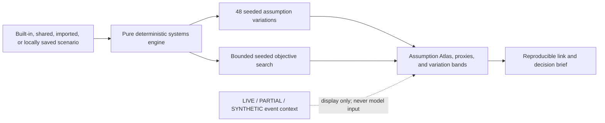

# Morrow

[](https://github.com/shauryamalhotra957-wq/morrow/actions) [](https://opensource.org/licenses/MIT)


> **Inspect the cascade. Compare the trade-offs.**

Morrow is an open, local-first crisis rehearsal lab for facilitated teaching and tabletop exercises. It turns a fictional compound-shock archetype into a transparent 72-hour systems simulation, lets a user allocate a constrained budget, exposes illustrative pathways, applies a disclosed shared stress case, compares four seeded-search objective winners, and exports a reproducible decision brief.

This repository is a complete, demo-ready product—not a static mockup. The model runs in the browser, controls change its illustrative outputs, seeded-search results are reproducible, and no API key or account is required for the core rehearsal. An optional backend API is included, but the client-side model does not depend on it.

## The one-sentence pitch

Existing crisis dashboards mostly explain **what and where**. Morrow gives an instructor or facilitator an inspectable teaching model for asking **what might happen next, which assumptions drive it, and how response choices compare under the same scenario**.

## What is already built

- Cinematic, responsive landing experience.
- Three compound-crisis scenarios: coastal cyclone, heat–water–grid shock, and urban earthquake.
- Offline world orientation map with a local scenario halo and optional event-context pins; country shading is not spatially modeled.
- Optional NASA EONET and USGS context overlays labeled **LIVE**, **PARTIAL**, or **SYNTHETIC**. These events never become model input and never alter a result.
- Eight budget-constrained interventions with deployment delays, saturation, and documented synergies.
- Assumption Atlas with visible illustrative pathways, weights, lags, equations, and model pressure.
- Deterministic 72-hour simulation with 48 seeded assumption variations and descriptive p10/p50/p90 bands.
- Responsive two-stage portfolio search: 160 budget-valid candidates are screened against balanced, early-action, vulnerability-intent, and stability-proxy objectives, then at most four unique winners receive the full 48-variation sensitivity run. It is a bounded search, not proof of global optimality.
- Disclosed shared stress control that degrades route access and power/communications-dependent protection while amplifying connected pathway pressure for every plan.
- Normalized leave-one-out sensitivities showing which funded interventions most change an illustrative combined outcome score; interaction effects mean these are not additive benefit shares.
- Reproducible scenario links plus Command actions to save, open, delete, and import validated local scenarios; JSON and CSV exports are also available.
- Print-designed decision brief with source references, limitations, and scenario fingerprint.
- Installable offline web app, strict import validation, CSP, and no analytics.
- Accessible chart tables, keyboard controls, reduced-motion support, mobile navigation, and visible focus states.

## Run it

Requirements: Node.js 20.19 or newer.

```bash
npm install
npm run dev
```

Open `http://localhost:4173`. Both the development and production-preview commands use that explicit project port.

Production build:

```bash
npm run check
npm run preview
```

`npm run check` runs linting, strict TypeScript, unit/component/property tests, and the production build.

## The three-minute demo

1. Click **Run the 72-hour rehearsal**.
2. Scrub the impact timeline and point out that the LIVE, PARTIAL, or SYNTHETIC badge describes optional context only; it does not drive the model.
3. Change an intervention allocation; the map, model proxies, seeded-variation band, and leave-one-out sensitivity update.
4. Open **Cascade** and inspect the Assumption Atlas from hazard to health-system load.
5. Apply the disclosed stress case and compare the before/after outcome deltas.
6. Open **Optimize**, run the seeded search, and inspect its four objective winners.
7. Apply the stability-proxy or balanced winner.
8. Generate the decision brief and show its assumptions, references, limitations, and reproducible fingerprint.
9. Turn off Wi-Fi after the app has installed and repeat the model locally.

The full presentation script is in [DEMO_SCRIPT.md](./DEMO_SCRIPT.md).

## Architecture at a glance



The simulation is deliberately not an LLM. It is a small inspectable teaching mechanism with explicit delays, saturation, synergies, bounds, and a seeded random generator. It is not locally calibrated and does not ingest live events into its equations. See [ARCHITECTURE.md](./ARCHITECTURE.md) and [METHODOLOGY.md](./METHODOLOGY.md).

## Verification commands

Use the repository commands as the source of truth for the current revision; this README does not freeze test counts or coverage percentages:

```bash
npm run lint
npm run typecheck
npm run test
npm run test:coverage
npm run build
npm audit
```

## Safety and honesty

Morrow is decision support for education, tabletop exercises, and early program comparison. It is **not** an authoritative alert, calibrated operational forecast, or autonomous allocator. Intervention coefficients are explicitly labeled illustrative assumptions. The product does not use personal data, track users, or display exact locations of vulnerable people.

See [MODEL_CARD.md](./MODEL_CARD.md), [SECURITY.md](./SECURITY.md), and [DATA_SOURCES.md](./DATA_SOURCES.md).

## Deployment

The client is a static Vite build. Deploy the `dist/` directory to any HTTPS static host. The included `public/_headers` file supplies production security headers on compatible hosts. Hash-based views require no server rewrite. The repository also includes an optional backend API; it is not required by the local model, and this client overview does not duplicate its separate operating details.

Detailed release steps are in [DEPLOYMENT.md](./DEPLOYMENT.md).

## Product and founder documents

- [BUSINESS_BLUEPRINT.md](./BUSINESS_BLUEPRINT.md) — five-phase, 90-day startup blueprint and 30-day sprint.
- [DEMO_SCRIPT.md](./DEMO_SCRIPT.md) — professor, recruiter, and competition presentation flow.
- [ARCHITECTURE.md](./ARCHITECTURE.md) — technical structure and data flow.
- [METHODOLOGY.md](./METHODOLOGY.md) — equations, seeded assumption variations, model proxies, and limitations.
- [DATA_SOURCES.md](./DATA_SOURCES.md) — provenance registry and connector policy.
- [MODEL_CARD.md](./MODEL_CARD.md) — intended and prohibited uses.
- [SECURITY.md](./SECURITY.md) — threat model and implemented controls.
- [ACCESSIBILITY.md](./ACCESSIBILITY.md) — interaction and inclusive-design contract.
- [DEPLOYMENT.md](./DEPLOYMENT.md) — release and rollback procedure.
- [CONTRIBUTING.md](./CONTRIBUTING.md) — engineering standards.
- [CHANGELOG.md](./CHANGELOG.md) — release history and material model changes.

## License

[MIT](./LICENSE). Bundled libraries and fonts retain their own terms and attributions in [THIRD_PARTY_NOTICES.md](./THIRD_PARTY_NOTICES.md). Third-party data remains governed by its source terms; Morrow links to official sources and does not imply their endorsement.